# 📚 Book Generation System - Architecture

## Complete File Flow Diagram

```mermaid
flowchart TD
    subgraph ENV["🔐 Environment"]
        envfile[".env<br/>API keys & config"]
        envexample[".env.example<br/>Template"]
    end

    subgraph UI["👤 User Interfaces"]
        app["app.py<br/>🖥️ Streamlit Web Dashboard"]
        main["main.py<br/>⌨️ CLI Interface"]
    end

    subgraph CONFIG["⚙️ Configuration"]
        config["config.py<br/>Loads .env variables"]
    end

    subgraph DATABASE["🗃️ Database Layer"]
        database["database.py<br/>Supabase CRUD operations"]
        schema["schema.sql<br/>Table definitions"]
    end

    subgraph AI["🤖 AI Layer"]
        llm["llm_service.py<br/>Gemini API wrapper"]
    end

    subgraph STAGE1["📥 Stage 1: Input"]
        input["input_handler.py<br/>Read Excel files"]
        inputdir["input/<br/>📁 Excel files"]
    end

    subgraph STAGE2["📝 Stage 2: Outline"]
        outline["outline_generator.py<br/>Generate book outlines"]
    end

    subgraph STAGE3["📖 Stage 3: Chapters"]
        chapters["chapter_generator.py<br/>Generate chapters with context"]
    end

    subgraph STAGE4["📄 Stage 4: Compilation"]
        compiler["compiler.py<br/>Create DOCX, PDF, TXT"]
        outputdir["output/<br/>📁 Generated books"]
    end

    subgraph NOTIFY["🔔 Notifications"]
        notif["notifications.py<br/>Email & Teams alerts"]
    end

    subgraph EXTERNAL["☁️ External Services"]
        supabase[("Supabase<br/>PostgreSQL DB")]
        gemini["Google Gemini<br/>AI Model"]
        smtp["SMTP Server<br/>Gmail"]
        teams["MS Teams<br/>Power Automate"]
    end

    %% Configuration Flow
    envfile --> config
    config --> database
    config --> llm
    config --> notif

    %% UI to Modules
    app --> config
    main --> config
    app --> input & outline & chapters & compiler & notif
    main --> input & outline & chapters & compiler & notif

    %% Database connections
    database --> supabase
    schema -.->|"Define tables"| supabase
    input --> database
    outline --> database
    chapters --> database
    compiler --> database

    %% AI connections
    llm --> gemini
    outline --> llm
    chapters --> llm

    %% Stage Flow
    inputdir --> input
    input -->|"Create book records"| outline
    outline -->|"Generate outline"| chapters
    chapters -->|"Generate all chapters"| compiler
    compiler --> outputdir

    %% Notifications
    outline -->|"Outline ready"| notif
    chapters -->|"Chapters ready"| notif
    compiler -->|"Book compiled"| notif
    notif --> smtp
    notif --> teams

    %% Styling
    style app fill:#667eea,color:#fff
    style main fill:#764ba2,color:#fff
    style supabase fill:#3ecf8e,color:#fff
    style gemini fill:#4285f4,color:#fff
    style smtp fill:#ea4335,color:#fff
    style teams fill:#6264a7,color:#fff
```



---

## Detailed File Responsibilities

```mermaid
flowchart LR
    subgraph FILES["📁 All Python Files"]
        direction TB
        
        subgraph ENTRY["Entry Points"]
            A1["app.py"]
            A2["main.py"]
        end
        
        subgraph CORE["Core Services"]
            B1["config.py"]
            B2["database.py"]
            B3["llm_service.py"]
        end
        
        subgraph WORKFLOW["Workflow Modules"]
            C1["input_handler.py"]
            C2["outline_generator.py"]
            C3["chapter_generator.py"]
            C4["compiler.py"]
        end
        
        subgraph SUPPORT["Support"]
            D1["notifications.py"]
        end
    end

    A1 & A2 --> B1
    B1 --> B2 & B3
    A1 & A2 --> C1 --> C2 --> C3 --> C4
    C2 & C3 --> B3
    C1 & C2 & C3 & C4 --> B2
    C2 & C3 & C4 --> D1
```



---

## File Descriptions

| File | Purpose | Uses | Used By |
|------|---------|------|---------|
| `.env` | Environment variables (API keys) | - | `config.py` |
| `config.py` | Load and validate configuration | `.env` | All modules |
| `database.py` | Supabase CRUD operations | `config.py` | All workflow modules |
| `llm_service.py` | Gemini AI API wrapper | `config.py` | `outline_generator.py`, `chapter_generator.py` |
| `input_handler.py` | Read Excel input files | `database.py` | `app.py`, `main.py` |
| `outline_generator.py` | Generate chapter outlines | `database.py`, `llm_service.py` | `app.py`, `main.py` |
| `chapter_generator.py` | Generate chapter content | `database.py`, `llm_service.py` | `app.py`, `main.py` |
| `compiler.py` | Create DOCX/PDF/TXT output | `database.py` | `app.py`, `main.py` |
| `notifications.py` | Send email/Teams alerts | `database.py`, `config.py` | `app.py`, `main.py` |
| `app.py` | Streamlit web interface | All modules | User |
| `main.py` | CLI interface | All modules | User |
| `schema.sql` | Database table definitions | - | Supabase setup |

---

## User Workflow

```mermaid
flowchart LR
    subgraph Step1["1️⃣ Add Book"]
        U1["User enters title"]
        U1 --> I1["input_handler.py<br/>or app.py form"]
        I1 --> D1["database.py<br/>create_book()"]
    end

    subgraph Step2["2️⃣ Generate Outline"]
        U2["User clicks Generate"]
        U2 --> O1["outline_generator.py"]
        O1 --> L1["llm_service.py<br/>generate_outline()"]
        L1 --> D2["database.py<br/>update_book()"]
        D2 --> N1["notifications.py<br/>notify_outline_ready()"]
    end

    subgraph Step3["3️⃣ Generate Chapters"]
        U3["User clicks Generate All"]
        U3 --> C1["chapter_generator.py"]
        C1 --> L2["llm_service.py<br/>generate_chapter()"]
        L2 --> D3["database.py<br/>update_chapter()"]
        D3 --> N2["notifications.py<br/>notify()"]
    end

    subgraph Step4["4️⃣ Compile Book"]
        U4["User clicks Compile"]
        U4 --> CP1["compiler.py"]
        CP1 --> D4["database.py<br/>get_chapters()"]
        D4 --> OUT["output/<br/>DOCX, PDF, TXT"]
        OUT --> N3["notifications.py<br/>notify_final_draft_ready()"]
    end

    Step1 --> Step2 --> Step3 --> Step4
```



---

## Import Dependencies


---

## Quick Reference

### File → External Service Mapping

```
config.py       →  .env (local file)
database.py     →  Supabase (PostgreSQL cloud)
llm_service.py  →  Google Gemini API
notifications.py→  Gmail SMTP + MS Teams Webhook
compiler.py     →  Local file system (output/)
input_handler.py→  Local file system (input/)
```

### Notification Triggers

```
outline_generator.py  →  "Outline ready for review"
chapter_generator.py  →  "Chapter X generated" / "All chapters ready"
compiler.py           →  "Book compiled successfully"
```
